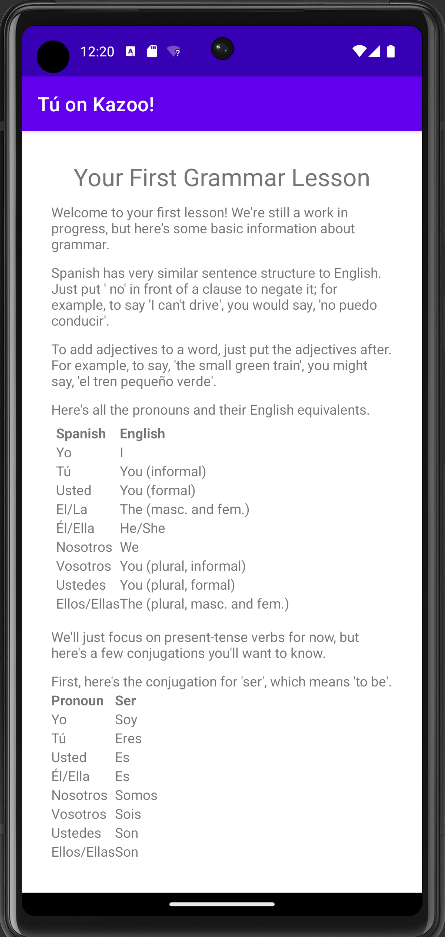
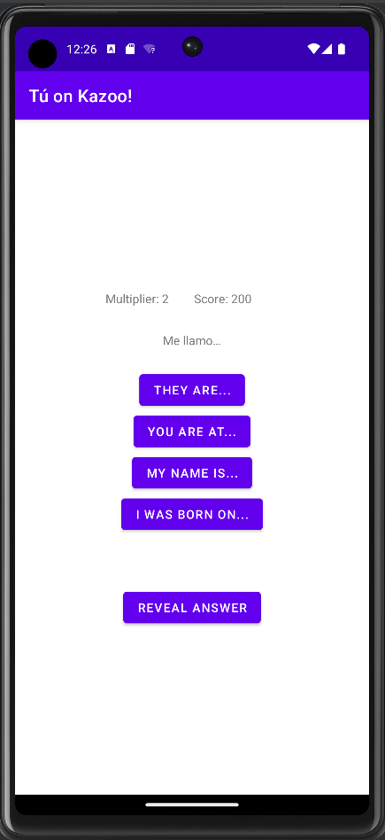
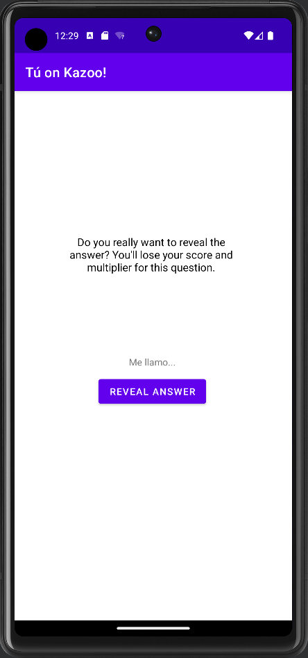

# Tú on Kazoo
Small Android-based quiz game for practicing Spanish fundamentals.

Comes with a page for a small lesson in basic Spanish grammar, and a quiz for practice. 10 questions are randomly selected, and you can gain a multiplier for your score for each consecutive correct answer. There's also a cheat function, but you lose your score for the question and your multiplier for using it.

